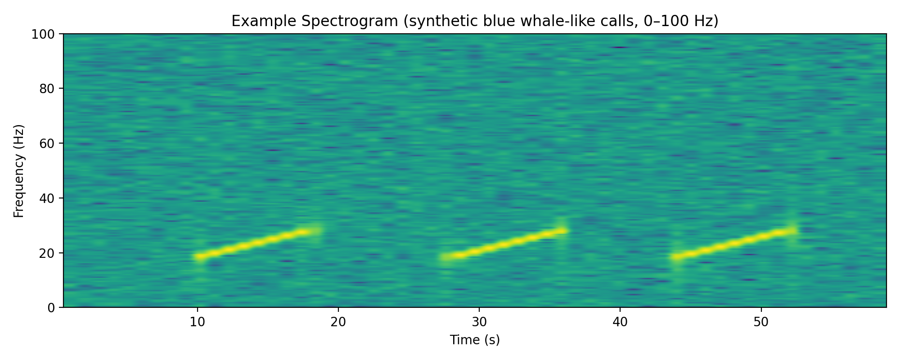
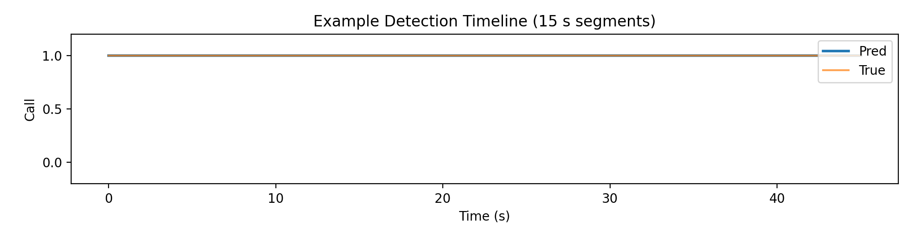

# ML Bioacoustics Signal Processing


End-to-end **signal-processing + machine-learning pipelines** for **blue whale vocalization detection**, implementing and reproducing two peer-reviewed research methods with industry-grade structure, testing, and CI.

This repository is designed as a **research-to-production portfolio**, demonstrating how classical signal processing and probabilistic ML models can be packaged into clean, testable, and reusable pipelines.

> **Target roles:** ML Engineer (time-series) • Data Scientist • Signal Processing Engineer • Research Scientist

---

## Results at a glance (safe + reproducible)

| What you can verify in this repo | How to reproduce | Output / evidence |
|---|---|---|
| **End-to-end runnable pipelines** (no notebooks required) | `python -m ml_bioacoustics.pipeline --mode synthetic --out results` | `results/spectrogram.png`, `results/detection_timeline.png` |
| **Real-data ingestion + annotation parsing** (TSV → segment labels) | Run `--mode real` with `--audio` + optional `--annotations` | Segment labels + detection timeline (and metrics when labels exist) |
| **Publication-style figures** (portfolio-ready) | Synthetic or real runs | PNG artifacts saved under `results/` |
| **Quality gates** (lint + tests + smoke) | GitHub Actions or `pytest -v` locally | CI badge + passing test logs |

> **Note on performance numbers:** Metrics depend on dataset/site/SNR and the annotation protocol. This repo prints **Accuracy/Precision/Recall/F1** automatically **when annotations are provided**—so you can report results honestly for your exact dataset.

---

## Example outputs (synthetic demo)

> These figures are generated from the built-in synthetic demo and illustrate the exact artifacts the pipeline produces.





---

## Implemented Research Methods

### 1. Multiscale Sample Entropy + Gaussian Mixture Model (MSE–GMM)

**Paper**  
> Babalola, O. P., Ogundile, O., & Balyan V. (2025).  
> *Multiscale Sample Entropy-Based Feature Extraction with Gaussian Mixture Model for Detection and Classification of Blue Whale Vocalization.*  
> **Entropy**, 27(4), 355.  
> https://doi.org/10.3390/e27040355

**Method summary**
- Band-limited preprocessing in blue whale frequency range
- Fixed 15-second, non-overlapping segments
- Multiscale Sample Entropy (MSE) feature vectors
- Unsupervised Gaussian Mixture Model (GMM) classification (optionally mapped to labels when annotations exist)

---

### 2. Wavelet Transform + Hidden Markov Model (WT–HMM)

**Paper**  
> Babalola, O. P., & Versfeld, D. J. (2024).  
> *Wavelet-based feature extraction with hidden Markov model classification of Antarctic blue whale sounds.*  
> **Ecological Informatics**, 82, 102468.  
> https://doi.org/10.1016/j.ecoinf.2024.102468

**Method summary**
- Continuous Wavelet Transform (CWT)
- Time–frequency energy, centroid, and entropy features
- Temporal modeling using Hidden Markov Models (HMMs)
- Robust under noisy and overlapping call conditions

---

## Quick Start (Synthetic Demo)

No datasets required. This is the CI-validated smoke test.

```bash
pip install -r requirements.txt
python -m ml_bioacoustics.pipeline --mode synthetic --out results
```

**Generated outputs**
- `results/spectrogram.png`
- `results/detection_timeline.png`

---

## Run on Real Bioacoustic Data (CLI)

### Required Inputs
- **Audio**: WAV file (the pipeline resamples to 1000 Hz by default)
- **Annotations (optional but recommended)**: TSV file with call start/end times (seconds)

> ⚠️ Real data files are **not committed** to this repository.

### Canonical CLI Signature

```bash
python -m ml_bioacoustics.pipeline \
  --mode real \
  --audio data/blue_whale_sample.wav \
  --annotations data/blue_whale_sample.tsv \
  --method mse-gmm \
  --segment-length 15 \
  --out results
```

Switch to WT–HMM:

```bash
python -m ml_bioacoustics.pipeline \
  --mode real \
  --audio data/blue_whale_sample.wav \
  --annotations data/blue_whale_sample.tsv \
  --method wt-hmm \
  --out results
```

### Output Artifacts
- Spectrogram PNG(s)
- Segment-level detection timeline
- Printed metrics (**Accuracy, Precision, Recall, F1**) when annotations exist
- All saved to the `--out` directory

---

## Supported Datasets (public sources)

- **Watkins Marine Mammal Sound Database** (small files, fast testing)
- **IWC–SORP / SOOS Antarctic Blue Whale Library** (annotated)  
  https://data.aad.gov.au/metadata/records/AcousticTrends_BlueFinLibrary74

---

## Testing & CI

Run tests locally:

```bash
pytest -v
```

GitHub Actions automatically runs:
- linting
- unit tests
- synthetic pipeline smoke test
- artifact generation (saved as CI artifacts)

---

## How this maps to the role you’re hiring for

### If you’re hiring for an **ML Engineer (time-series)**
What to look for in this repo:
- Reproducible CLI pipelines + deterministic outputs
- Clear module boundaries (I/O → preprocessing → features → models → viz)
- Tests + CI (quality gates, automation)
- Data/label handling (annotation parsing → metrics)

### If you’re hiring for a **Research Scientist / Data Scientist**
What to look for in this repo:
- Paper-aligned implementations of MSE–GMM and WT–HMM
- Signal-aware features (entropy, wavelets) and probabilistic modeling (GMM/HMM)
- Reproducibility + research citation (`CITATION.cff`)
- Extensible baselines and evaluation hooks

---

## Citation

If you use this code in academic work, please cite:
- the software (see `CITATION.cff`)
- both original research papers listed above

---

## Author

**Dr. Oluwaseyi Paul Babalola**  
PhD (Electronic Engineering) • Senior IEEE Member

Research interests:
- signal processing
- bioacoustics
- probabilistic machine learning
- interpretable detection systems
